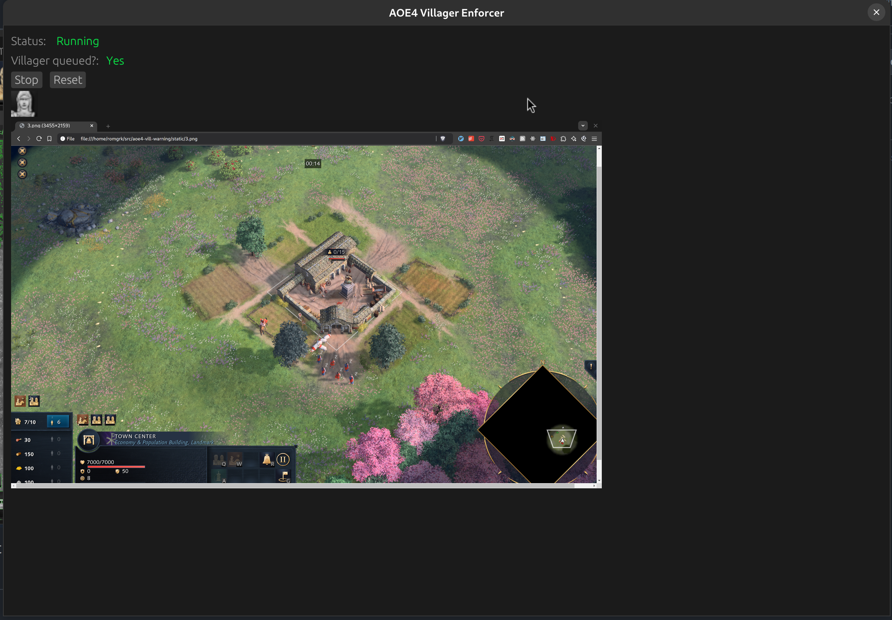

# aoe4 villager enforcer

This program plays a loud high-pitched tone when there is no vill in queue.

It works by scanning the screen for a villager image at a certain height. Because each civ has a different icon, it needs to be re-configured each time you want to play a new civ.

> [!CAUTION]  
> This is provided as a **training** software. Using this software in ranked games is **cheating**.
>
> The training works only if you put the game volume as low as possible, and the windows volume
> as loud as possible. If you don't, you'll be training yourself to stop checking for vill
> production and you'll end up only relying on the tone. If you want to avoid training yourself
> to be a cheater, it needs to hurt. Put the volume at 100%.

### Usage

1. Download from: https://github.com/romgrk/aoe4-villager-enforcer/releases
2. Start AOE4
3. Start a skirmish game with the civ you want to configure it with, and put a few vills in queue. Make sure the vill queue icon is on a light background/terrain.
4. Open the program now. Not before, now. You should see the configuration screen.
5. Click on the first vill icon. Important to pick the one that has the small number. You should now see the main screen.
6. When you're ready to start a game, click `Start`
7. Go train in custom games with friends or against the AI.
  

| Configuration | Main |
| --- | --- |
|  |  |

> [!WARNING]  
> I wrote this in a week-end so this is very hacky. Don't expect much.
