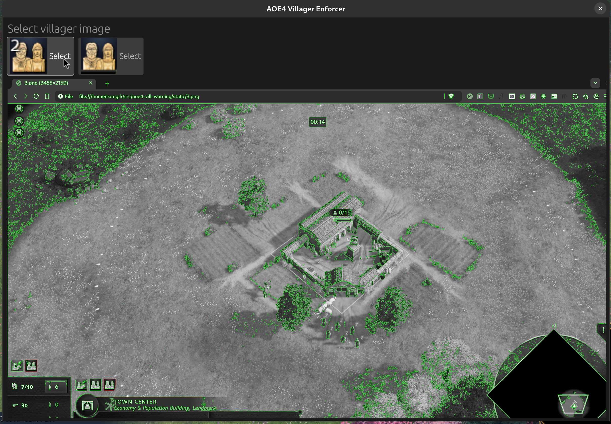

# aoe4 villager enforcer

This program plays a loud audio noise when there is no vill in queue.

**NOTE**: I wrote this in a week-end so this is very hacky. Don't expect much.

### Getting started

1. Download from: https://github.com/romgrk/aoe4-villager-enforcer/releases
2. Start AOE4
3. Start a skirmish game with the civ you want to configure it with, and put a few vills in queue.
4. Open the program now. Not before, now. This is what you should see:
  
5. Click on the first vill icon. Important to pick the one that is always visible.
